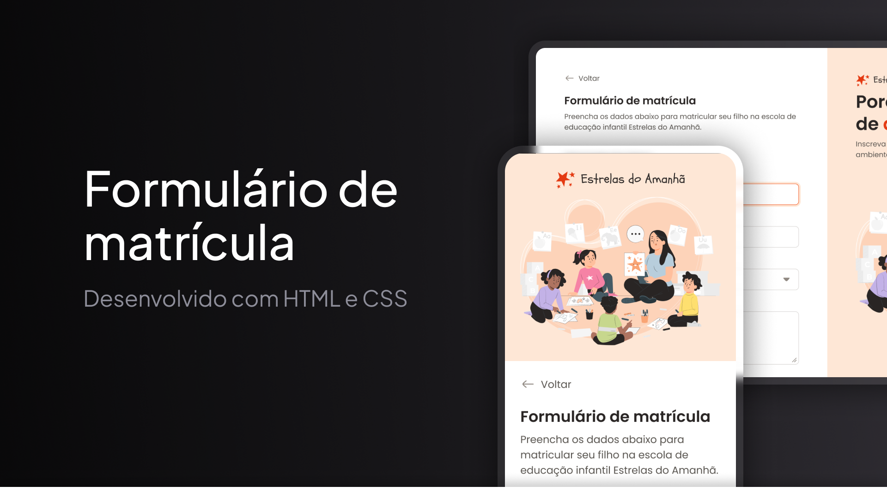

<h1 align="center"> Formulário de Matrícula Escolar </h1>

Projeto de formulário responsivo desenvolvido para praticar fundamentos de desenvolvimento web. 

  <a href="#projeto">Projeto</a>&nbsp;&nbsp;&nbsp;|&nbsp;&nbsp;&nbsp;
  <a href="#tecnologias-utilizadas">Tecnologias</a>&nbsp;&nbsp;&nbsp;|&nbsp;&nbsp;&nbsp;
  <a href="#funcionalidades">Funcionalidades</a>&nbsp;&nbsp;&nbsp;|&nbsp;&nbsp;&nbsp;
  <a href="#responsividade">Responsividade</a>

 

  

## Projeto

O Formulário de Matrícula Escolar é uma página desenvolvida com foco em praticar a estruturação de formulários com HTML e a criação de interfaces responsivas com CSS.

O projeto simula um formulário de matrícula para uma escola de educação infantil, reunindo campos para informações da criança, endereço residencial, dados do responsável, envio de documentos e seleção de opções de matrícula.

A interface foi organizada em seções para facilitar o preenchimento e manter uma boa experiência de uso em diferentes tamanhos de tela.

## Tecnologias utilizadas

- HTML
- CSS
- Git
- GitHub
- Figma

## Funcionalidades

- Formulário de matrícula com informações da criança e do responsável
- Preenchimento do endereço residencial
- Área de upload para certidão de nascimento
- Opções de seleção para turno de estudo e atividade esportiva
- Radio buttons e checkbox personalizados
- Destaque visual para campos em foco
- Mensagem visual de validação de e-mail
- Termos e condições para confirmação da matrícula
- Botões para salvar respostas e enviar o formulário
- Layout adaptado para desktop e dispositivos móveis

## Responsividade

O layout original para desktop foi adaptado para telas menores por meio de media queries.

Na versão mobile, o conteúdo é reorganizado para melhorar a leitura e facilitar o preenchimento do formulário.

As principais adaptações realizadas foram:

- alteração do layout principal de duas colunas para uma coluna
- posicionamento da área ilustrativa acima do formulário
- redimensionamento da logo e da ilustração
- redução dos espaçamentos laterais
- adaptação dos campos à largura disponível
- reorganização dos botões em uma única coluna
- centralização dos textos dos botões
- liberação da rolagem vertical da página
- manutenção dos cards de seleção em uma grade responsiva

## Projeto online

- [Acesse o projeto finalizado, online](https://felipe-hendrich.github.io/projeto-formulario-de-matricula/)

## Aprendizados

Neste projeto, pratiquei:

- estruturação semântica de formulários com HTML
- estilização e organização visual com CSS
- criação de layouts com CSS Grid e Flexbox
- organização do conteúdo em múltiplas seções
- criação de componentes personalizados
- uso das pseudo-classes `:hover`, `:focus-within`, `:checked` e `:has()`
- criação de layouts responsivos com media queries
- adaptação de um layout desktop para dispositivos móveis
- controle de largura, altura e overflow
- reorganização visual de elementos com a propriedade `order`
- uso de variáveis CSS para cores, fontes e estilos
- organização do CSS em diferentes arquivos
- uso de Git e GitHub para versionamento e publicação

## Créditos

Projeto desenvolvido com base no conteúdo do FullStack, da Rocketseat, com adaptações de responsividade e personalizações aplicadas durante a prática.
